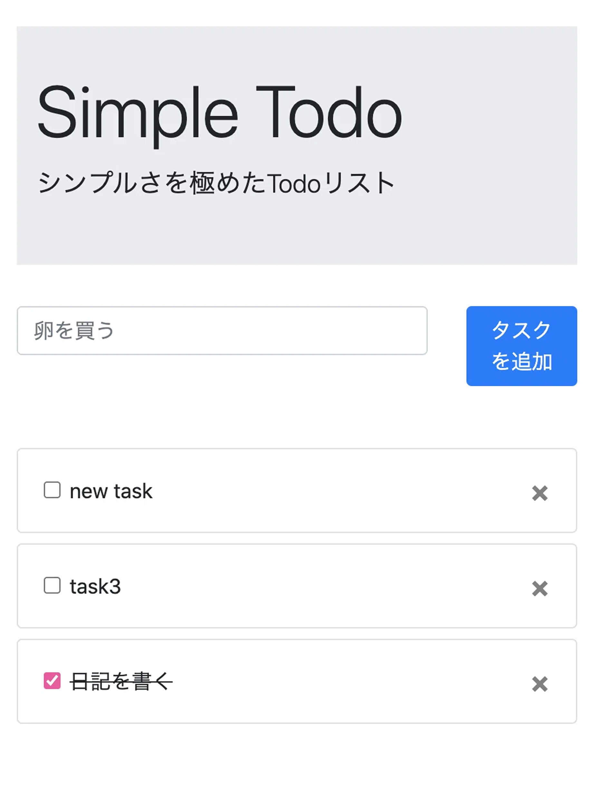
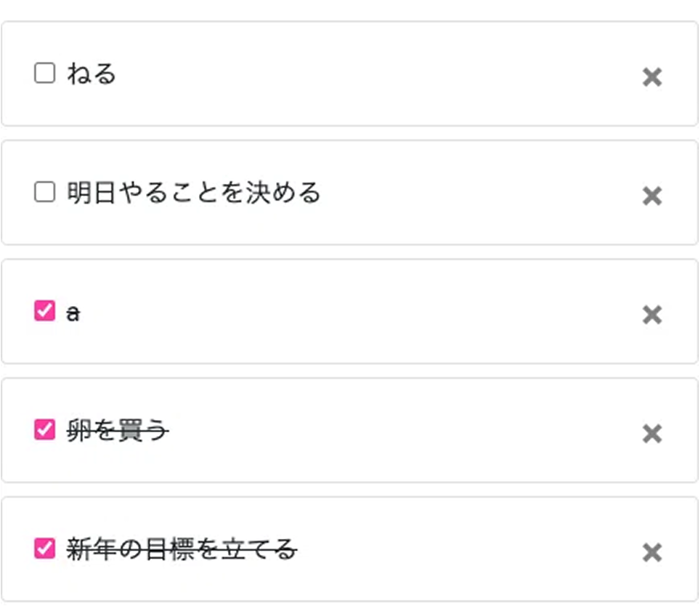
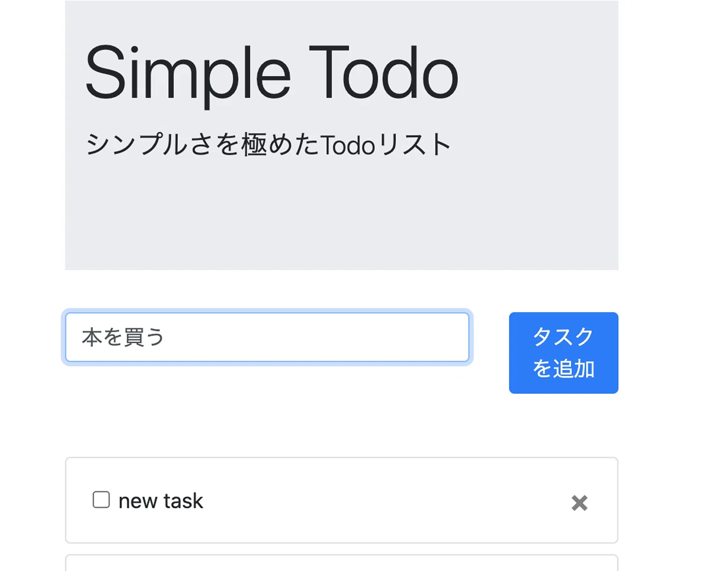
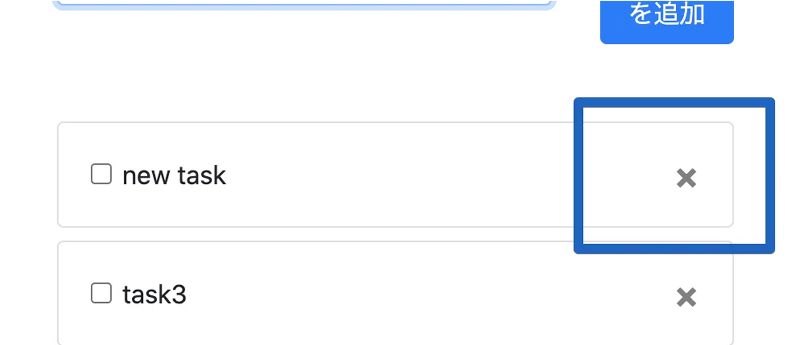
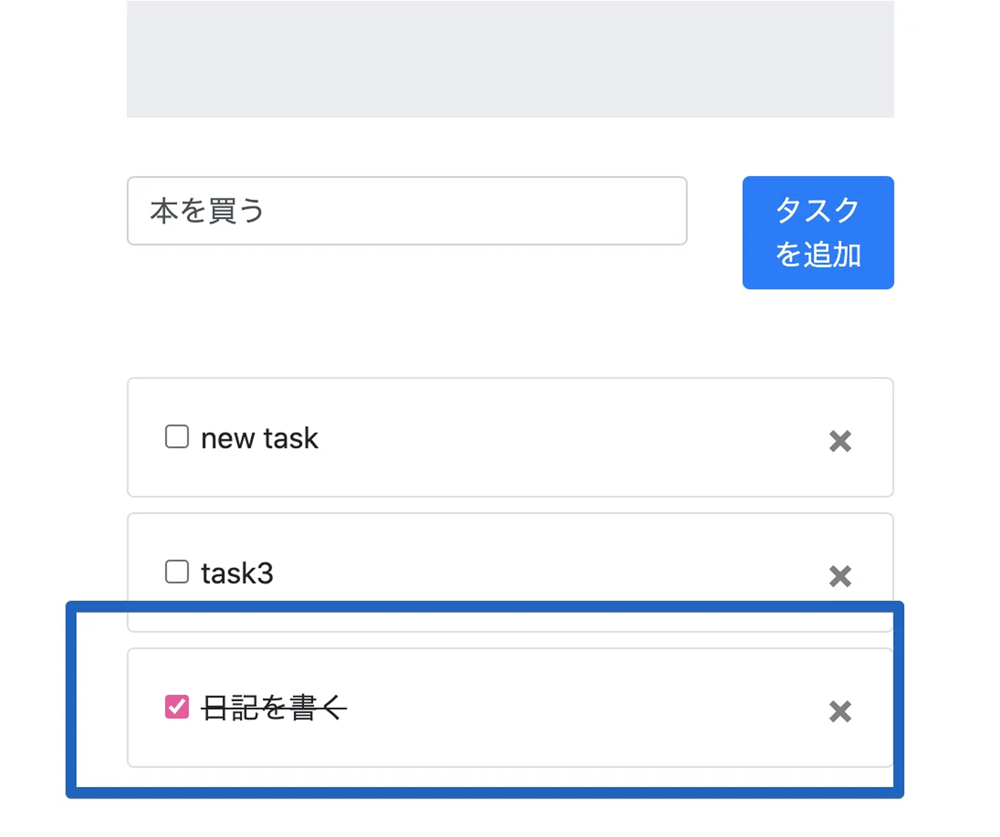

# 📝 Simple Todo App with Django and Vue.js

This is a Single Page Application (SPA) Todo app built with Django and Vue.js.  
The approach avoids the complexities of Django REST Framework by using the Fetch API to connect Vue.js with Django.
---

## 🚀 Features

- **Task List**: View all tasks.
- **Add Task**: Create new tasks.
- **Delete Task**: Remove tasks.
- **Mark as Completed**: Check off tasks as completed.

---

## 📸 Screenshots

| Task List | Add Task | Delete Task | Mark Completed |
|-----------|---------|------------|----------------|
|  |  |  |  |

*Replace the placeholder paths (`./images/...`) with your actual image files.*

---

## 🔧 Technologies Used

- **Backend:** Django  
- **Frontend:** Vue.js, Bootstrap  
- **API:** Fetch API  
